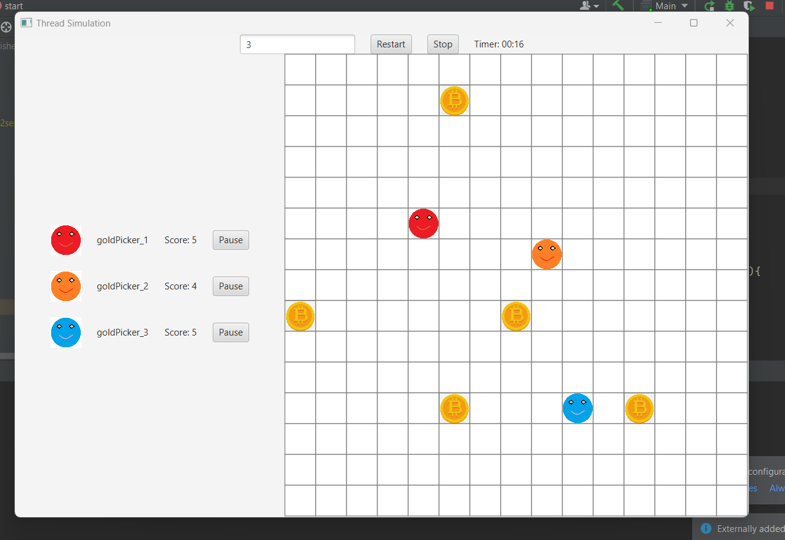

# Multi-Threading
 Freelance project

Multi Threading Simulation!
we have placed coins in screens, and we have gold picker
a single gold picker is a single thread. so they lock on the target, and they pick the coin.

UI representation is not that great cuz most of the work is done in backend.

client feedback
